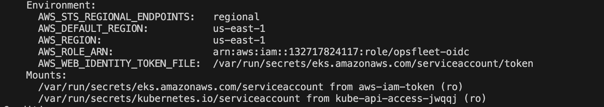

# Opsfleet EKS Cluster Deployment using Terraform

This repository contains Terraform configurations for deploying Opsfleet EKS cluster within an existing AWS VPC and configuring Kubernetes pods to assume AWS IAM roles.

## Prerequisites

- AWS CLI installed and configured
- Terraform >= 5.31.0
- kubectl configured to interact with your Kubernetes cluster
- AWS account with necessary permissions

## Getting Started

1. **Clone the Repository**:
   ```
   git clone 'repository-url'
   cd 'repository-dir'
   ```

2. **Initialize Terraform**:
   ```
   terraform init
   ```

3. You can modify the default values provided via the variables.tf file by passing environment variables before applying the codes.

4. **Apply Terraform Plan**:
   ```
   terraform apply
   ```

   Review the plan and type `yes` to proceed with the deployment.

## Configuring Your EKS Cluster

Once the EKS cluster is up and running, configure `kubectl` to interact with your new cluster:

```
aws eks --region region update-kubeconfig --name cluster-name
```

Replace `region` and `cluster-name` with your specific details.

Using the default variables, you will have:

```
aws eks --region us-east-1 update-kubeconfig --name opsfleet-core
```

## Deploying Pods with IAM Roles

### Creating an IAM Role for Pods

Create an IAM role with the necessary permissions to access the desired AWS services and setting the principal as the openid connect provider. You should also set conditions for aws to approve your requests, in our code we created a role that uses the openid connect provider as principal and also sets a condition to allow a service account with name: 'aws-s3-access' in any namespace (*) to assume our role.

### Annotating Kubernetes Service Account

Annotate the Kubernetes service account to associate it with the IAM role:

```yaml
apiVersion: v1
kind: ServiceAccount
metadata:
  name: service-account-name
  annotations:
    eks.amazonaws.com/role-arn: role-arn
```
Replace `service-account-name` and `role-arn` with your specific details.
Note: The terraform code outputs the arn of the role we created


### Running Pods with the Service Account

Modify your pod specification to use the service account:

```yaml
apiVersion: v1
kind: Pod
metadata:
  name: pod-name
spec:
  serviceAccountName: service-account-name
  containers:
  - name: opsfleet
    image: nginx|any_image
```

## Accessing AWS Services from Pods

Pods using the annotated service account can now assume the IAM role and interact with AWS services according to the permissions defined in the IAM role.
To verify if your Pod assumed this role, run `kubectl get pods` then `kubectl describe pod name-of-pod`
you should see something like the image below:



## Cleaning Up

To destroy the EKS cluster and related resources managed by Terraform:

```
terraform destroy
```
